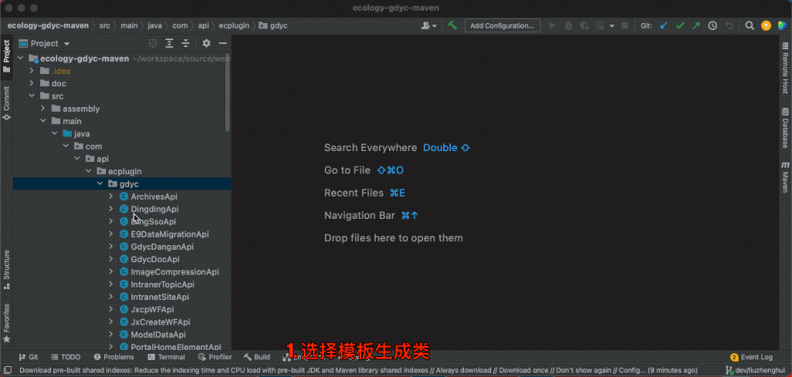
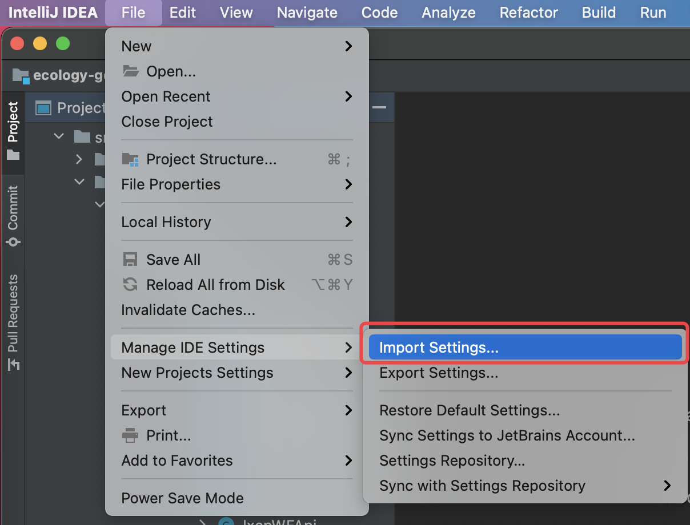
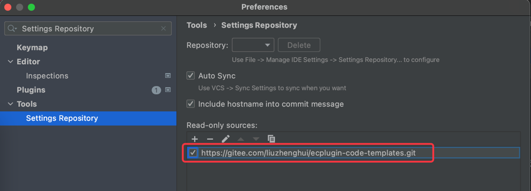

## 代码模板说明

​        本仓库整理了开发中常用到的一些代码块，以idea模板方式提供使用。目标是减少开发中重复编码和到处查找资料的问题，提高编码效率。效果见下图：




## 使用方法

1. 导入设置
   
   文件下载：https://raw.githubusercontent.com/liuzhenghui/ecplugin-code-templates/master/settings-import.zip

   
   
2. 配置在线自动更新

   URL填写本仓库地址：```https://github.com/liuzhenghui/ecplugin-code-templates.git```

   


## 文件模板(FileTemplates)

| 说明            | 模板名                    | 备注   |
| --------------- | ------------------------- | ------ |
| Api接口类       | EcpluginWebApi.java       |        |
| Service类       | EcpluginService.java      |        |
| Dto类           | EcpluginDto.java          |        |
| 外部数据源Dao类 | EcpluginDataSouceDao.java |        |
| mybaits接口     | EcpluginMapper.java       | 待整理 |
| mybatis xml     | EcpluginMapper.xml        |        |
| jsp             | EcpluginJspPage.jsp       |        |

## 代码模板(LiveTemplates)

| 分类         | 说明                  | 缩写                  | 备注   |
| ------------ | --------------------- | --------------------- | ------ |
| 常用         | lombok四件套          | ecLombok              |        |
|              | 打印日志              | ecLogMethodParameters |        |
|              | 异常处理              | ecTry                 |        |
|              | 打开session返回Mapper | ecSqlSessionMapper    |        |
|              | 获取配置文件中值      | ecProp                |        |
| 接口相关     | 创建get接口           | ecApiGet              |        |
|              | 创建post接口          | ecApiPost             |        |
|              | 创建分页接口          | ecApiPage             |        |
|              | 创建json接口          |                       | 待整理 |
|              | 上传文件              |                       | 待整理 |
|              | 下载文件              |                       | 待整理 |
| mybatis 相关 | count                 | ecCountSql            |        |
|              | select                | ecSelectSql           |        |
|              | insert                | ecInsertSql           |        |
|              | update                | ecUpdateSql           |        |
|              | where                 | ecWhereSql            |        |
|              | where if              | ecWhereIfSql          |        |
|              | where like            | ecWhereLikeSql        |        |
|              | for each条件          | ecForeachSql          |        |
|              | 多选字段匹配条件      | ecLikeIdsSql          |        |
| 文件相关     | 解压                  |                       | 待整理 |
|              | 压缩                  |                       | 待整理 |
|              | 拷贝                  |                       | 待整理 |
|              | 遍历目录              |                       | 待整理 |
|              | 删除                  |                       | 待整理 |
| http请求相关 | post请求              |                       | 待整理 |
|              | get请求               |                       | 待整理 |
|              | 下载文件              |                       | 待整理 |
| 用户         | 后端登录              | ecUserLogin           |        |
|              | 获取当前Request用户   | ecUserCurrent         |        |
|              | 获取当前Session用户   | ecUserSession         |        |
| 流程         | 发起流程              | ecWfCreate            | 待整理 |
|              | 提交流程              | ecWfSubmit            |        |
|              | 获取下一节点          | ecWfNextNodeInfo      |        |
|              | 快速更新表数据        | ecWfUpateTable        |        |
|              | 快速插入表数据        | ecWfInsertTable       |        |
|              | 获取明细表数据        | ecWfGetDetailData     |        |
| 建模         | 快速插入建模          | ecModeCreateData      |        |
|              | 插入建模              |                       | 待整理 |
| 文档         | 创建文档              |                       | 待整理 |
|              | 获取文档              |                       | 待整理 |
|              | 获取附件              |                       | 待整理 |
|              | 拷贝文档              |                       | 待整理 |