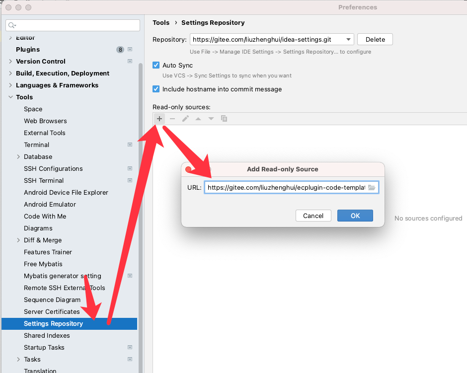

## 使用方法1

1. 第一次手动导入设置
   
   https://gitee.com/liuzhenghui/ecplugin-code-templates/raw/master/settings-import.zip
   
2. idea 中配置在线自动更新
   

## 清单
| 分类 | 缩写 | 范围 |
| --- | --- | --- |
| 文件 | EcWebApi | 新建文件 |
|  | EcService | 新建文件 |

## 待整理清单

**文件**

- 解压
- 压缩
- 拷贝
- 遍历目录
- 删除

**http**

- post请求
- get请求
- 下载文件

